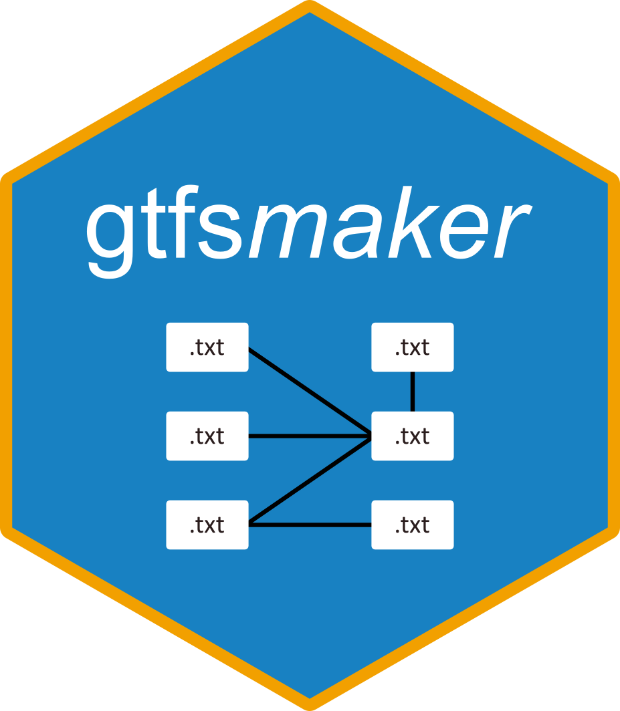
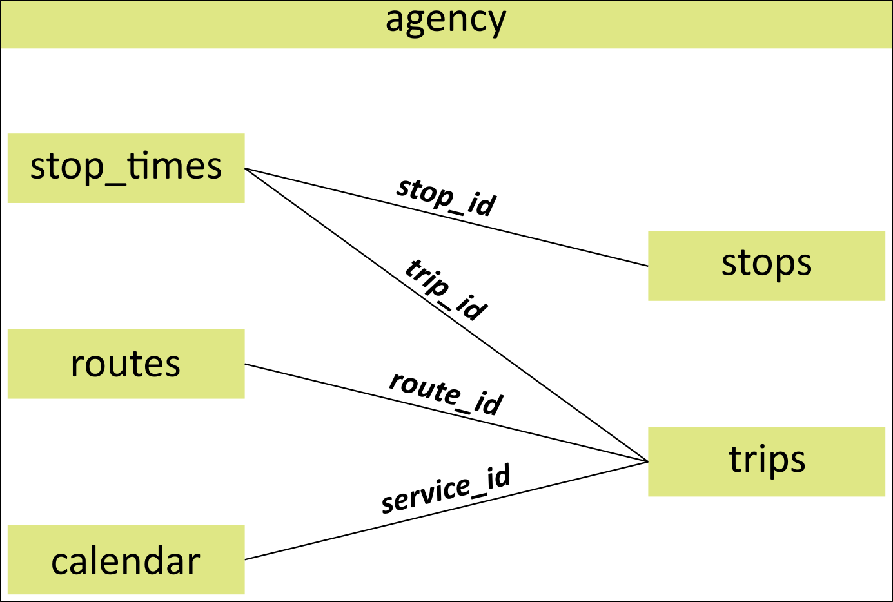
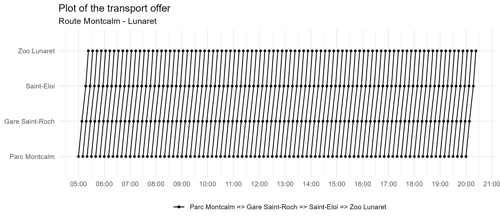
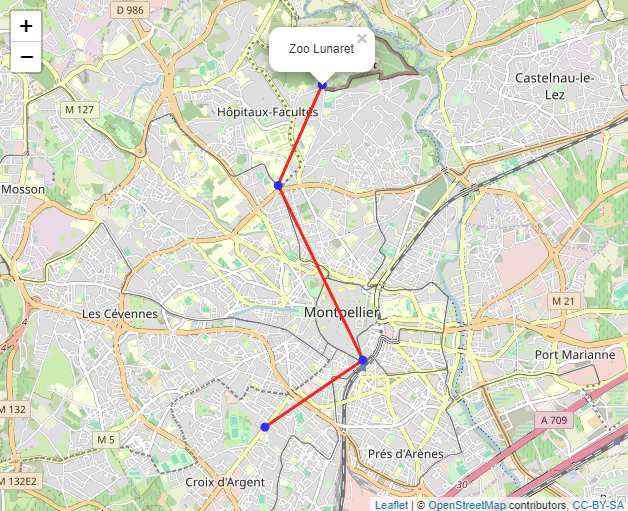

<!-- README.md is generated from README.Rmd. Please edit that file -->

# gtfsmaker 

<!-- badges: start -->

[](https://github.com/jc-ulles/gtfsmaker/actions/workflows/R-CMD-check.yaml)

<!-- badges: end -->

Create your own GTFS. This package aims to build a functional GTFS from
scratch by adding your own transport offer data. The functions are
designed to automate and simplify the process of adding data to the
files that make up the GTFS. The new GTFS produced can be saved and used
in `opentripplanner`.

## Installation

You can install the development version of gtfsmaker from
[GitHub](https://github.com/) with:

``` r
# install.packages("devtools")
devtools::install_github("jc-ulles/gtfsmaker")
```

## How the GTFS works

GTFS is a format for structuring public transport data. It consists of
six mandatory files in .txt format (`agency`, `stops`, `stop_times`,
`trips`, `routes`, `calendar`). They are linked together by
identification keys (`route_id`, `trip_id`, `service_id`, `stop_id`).
Please visit <https://gtfs.org> for information.



## Example

An example of creating a GTFS from fictitious data:

``` r
library(gtfsmaker)

# Create all the files needed in the R environment
gtfs_files()

# Add a new transport agency
add_agency(name = "Transport Montpellier TAM",
           url = "www.tam-voyages.com/",
           timezone = "Europe/Paris")

# Add some stops with location
add_stop(lat = 43.59690,
         lon = 3.86357,
         name = "Parc Montcalm")

add_stop(lat = 43.60524,
         lon = 3.88039,
         name = "Gare Saint-Roch")

add_stop(lat = 43.62695,
         lon = 3.86584,
         name = "Saint-Eloi")

add_stop(lat = 43.63946,
         lon = 3.87340,
         name = "Zoo Lunaret")

# Add a new route: long name and mode of transport (0 is for the tram)
add_route(name = "Montcalm - Lunaret",
          type = 0)

# Add a new trip belonging to a route (1 is for the route_id created when the route
# was added previously)
add_trip(route_id = 1,
         service_id = 1)

# Add some transport services corresponding to a trip (trip_id), a timetable, a stop
# (stop_id) and the order of progression in the sequence
add_stop_time(trip_id = 1,
              time = "05:00:00",
              stop_id = 1,
              sequence = 1)

add_stop_time(trip_id = 1,
              time = "05:08:00",
              stop_id = 2,
              sequence = 2)

add_stop_time(trip_id = 1,
              time = "05:17:00",
              stop_id = 3,
              sequence = 3)

add_stop_time(trip_id = 1,
              time = "05:23:00",
              stop_id = 4,
              sequence = 4)

# Repeat the sequence of the selected transport service (trip_id) up to a maximum time,
# following a defined time step (in minutes)
repeat_stop_times(trip_id = 1,
                  max_time = "20:00:00",
                  breaks = 10)

# Add a calendar defining the days on which the service operates (Monday to Sunday)
# and the time slot
add_calendar(service_id = 1,
             monday = 1,
             tuesday = 1,
             wednesday = 1,
             thursday = 1,
             friday = 1,
             saturday = 1,
             sunday = 1,
             start_date = 20240511,
             end_date = 20241231)
```

Plot the transport offer with `plot_trips()`:

``` r
plot_trips(route_id = 1,
           size_point = 1,
           size_line = 0.5)
```



Plot the leaflet map of a selected route with `plot_map()`:

``` r
plot_map(route_id = 1)
```



Save the new GTFS with `gtfs_save()`:

``` r
gtfs_save(filename = "C:/...")
```
